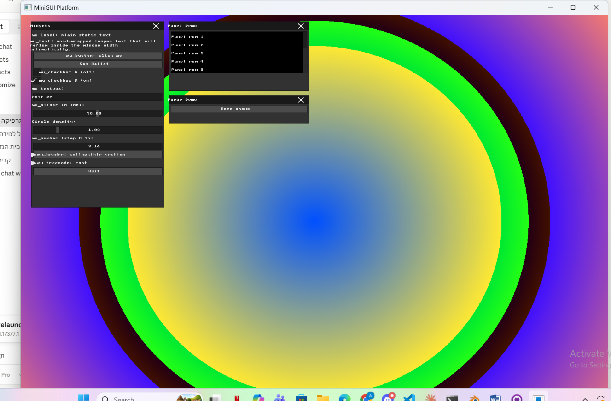
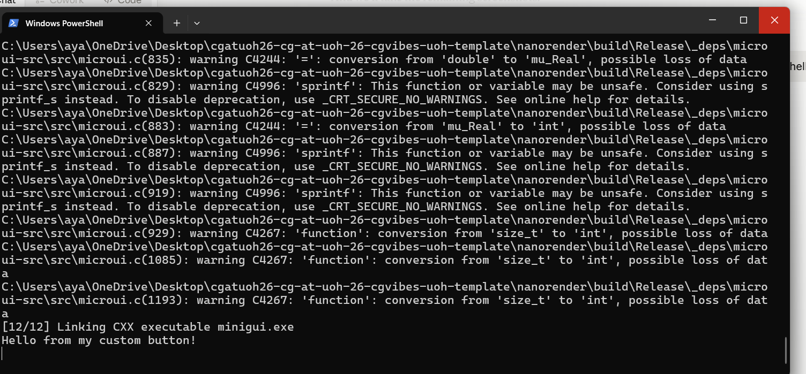
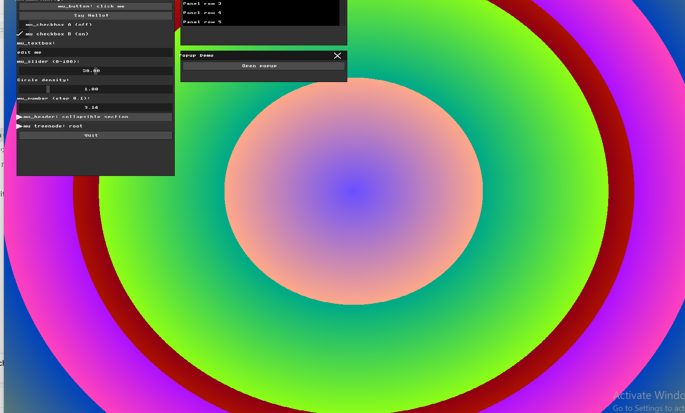
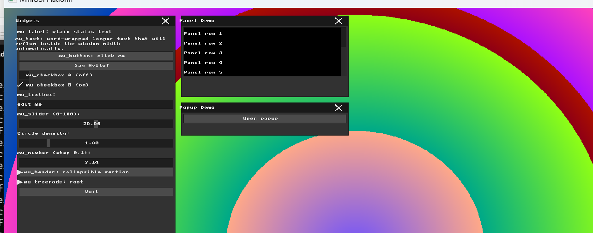
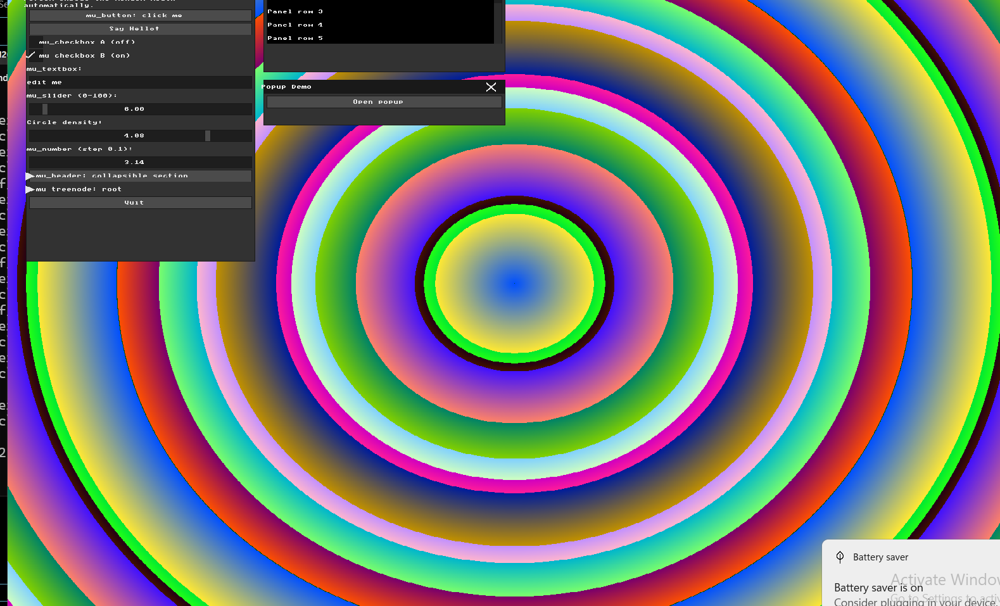
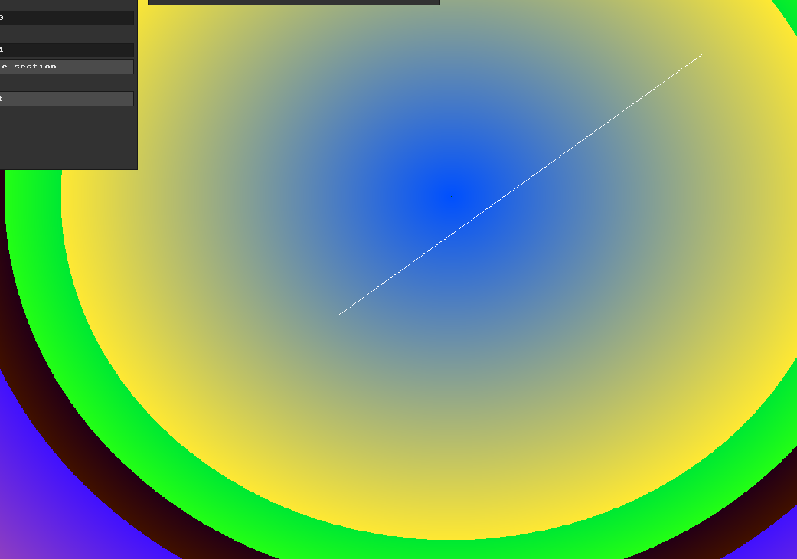

# HW1 Report: Basic Graphics and Immediate Mode GUI

## Part 1: Manipulating the Framebuffer
Instead of the default gradient, I wanted to create something more visually interesting. I calculated the distance of each pixel from the center of the screen and used that to generate concentric colored circles. The further a pixel is from the center, the more the color shifts — creating a kind of rainbow bullseye effect. I used the `dist` variable with different multipliers for `r`, `g`, and `b` to get contrasting colors at each ring.

## Part 2: Immediate Mode UI Declaration
I added a simple "Say Hello!" button right below the existing button in the Widgets panel. When you click it, it prints a message to the console. This helped me understand how Immediate Mode works — the button doesn't "exist" between frames, it's just declared fresh every frame, and MicroUI checks if it was clicked during that frame.

## Part 3: Real-Time Input Handling
I intercepted the keyboard callback and added logic to detect when the user presses 'r'. When that happens, a global variable `g_color_shift` gets a random value, which shifts the red channel of the entire background pattern. The change is instant and visible — every press gives a different color combination.

## Part 4: UI Architecture & The Renderer Bridge
I added a `glitch_offset` of 40 pixels inside `draw_rect` in `ui_renderer.cpp`. This shifts where every UI rectangle is actually drawn on screen, making the whole interface appear offset to the right. When I tried clicking a button, nothing happened — because MicroUI detects clicks based on the original rectangle position, not where it was drawn. To actually trigger a button, you'd need to click 40 pixels to the left of where you see it. This really showed me how rendering and interaction logic are completely separate systems.

## Part 5: Binding UI to Application State
I created a new variable `circle_density` and connected it to a new slider in the UI. When you drag the slider, the density value changes and the circles in the background immediately respond — they either spread out or compress together. This showed me how Immediate Mode widgets don't store state themselves, they just read and write to external variables through pointers.

## Part 6: Interactive Line Drawing
I implemented Bresenham's Line Algorithm from scratch. The algorithm handles all directions and slopes without floating point math. To make lines permanent, I added a separate `g_line_buffer` that never gets cleared — lines drawn there survive every frame redraw. The user interaction works like this: click to set the start point, hold and drag, release to draw the final line. I chose this approach because it gives a clear preview moment and feels natural, like drawing on a canvas.

