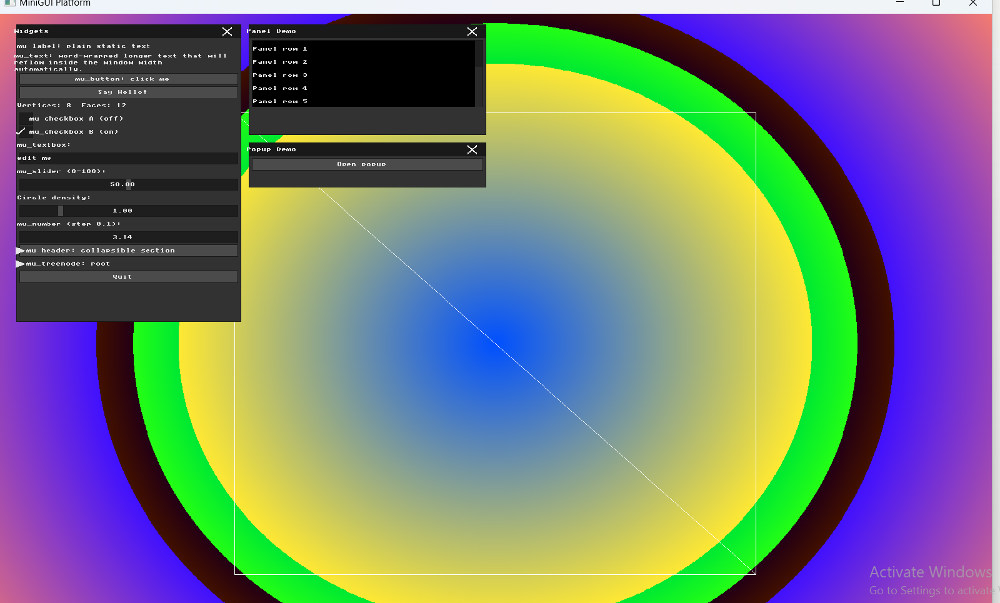
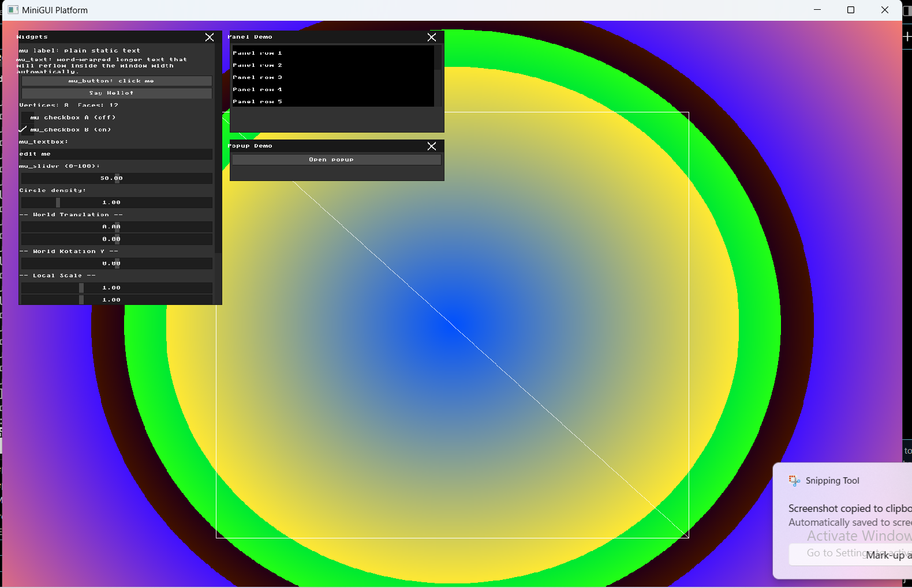
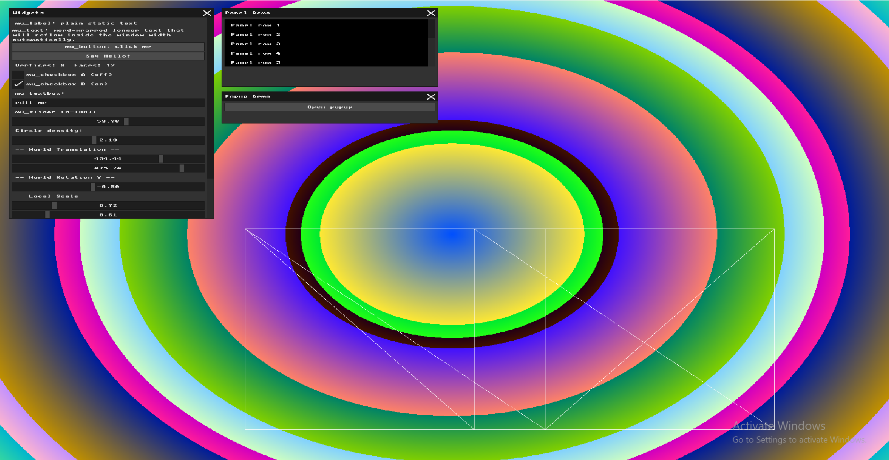
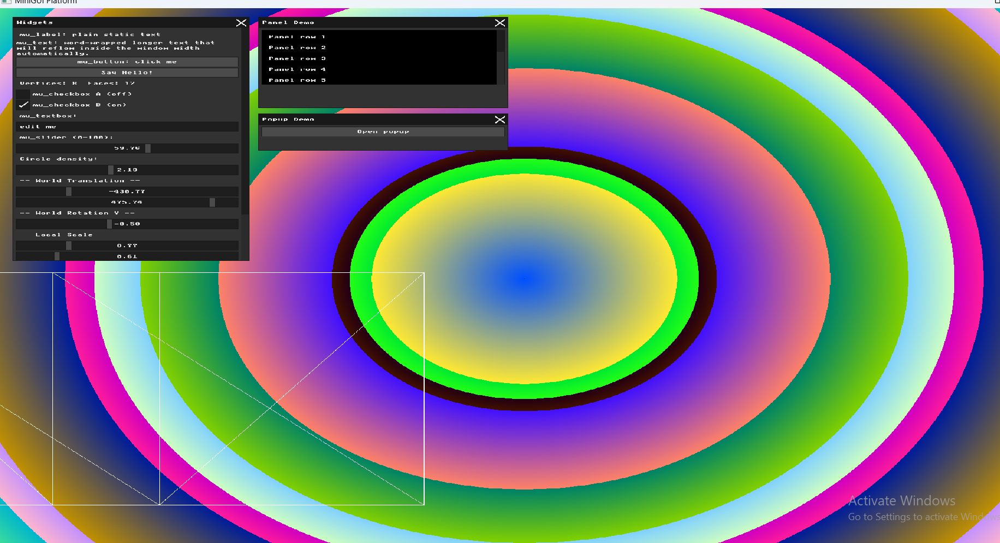
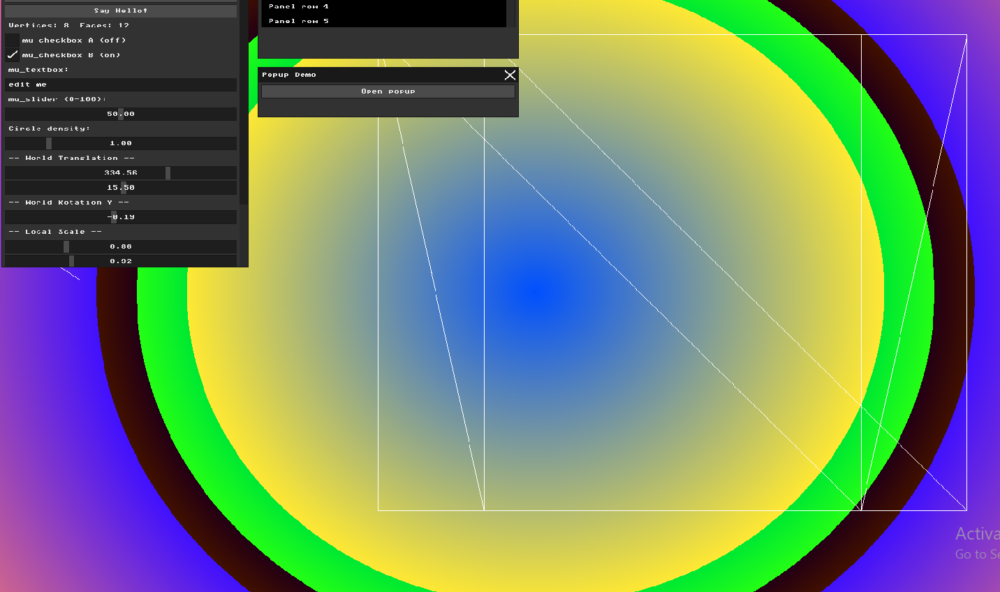

# HW2 Report: Wireframe Viewer and Geometric Transformations

## Part 0: Introduction to GLM
I added GLM to the project by updating `CMakeLists.txt` to fetch it automatically using `FetchContent`. To verify it worked, I created a `glm::vec3` position and a translation matrix, then printed the position to the console. GLM is a header-only math library that makes 3D transformations much easier to write and understand.

## Part 1: Loading and Inspecting 3D Data
I wrote a `load_obj` function that reads `.obj` files line by line. Lines starting with `v` are parsed as vertices (x, y, z), and lines starting with `f` are parsed as faces (triangle indices). I created a simple `cube.obj` file with 8 vertices and 12 triangular faces to test the loader. The mesh info is displayed in the GUI showing "Vertices: 8  Faces: 12".

## Part 2: Normalization and the Viewport Transform
I wrote a `normalize_mesh` function that finds the bounding box of the mesh by scanning all vertices for min/max x and y values. Then I calculated a uniform scale factor by dividing the screen size by the mesh range, taking the smaller of the two axes to ensure the mesh fits in both dimensions. Finally I translated the mesh center to the screen center so the model always appears centered regardless of its original coordinates.

## Part 3: Orthographic Projection and Wireframe Rendering
I iterated over all the faces in the mesh. For each triangle, I retrieved its three vertices and dropped the z coordinate to project them onto the 2D screen (orthographic projection). Then I drew the three edges of each triangle using the `draw_line_bg` function. The result is a white wireframe cube visible on the colorful background.

## Part 4: Transformation Matrices & Immediate Mode GUI
I added new GUI sliders to control World Translation (X, Y), World Rotation Y, and Local Scale (X, Y). Each slider is bound to a static variable that will be used to compute the transformation matrices in Part 5.

## Part 5: Applying Transformations
I used GLM to build transformation matrices from the slider values. The local matrix applies scale first, then the world matrix applies rotation and translation. The final matrix is `world * local`. When I translate first in local space then rotate in world space, the cube moves to a position and then rotates around the world origin. When I rotate first then translate in world space, the cube spins in place and then moves.

## Part 6: Interactive Input Modifiers
I mapped the arrow keys to World Translation using `mfb_set_keyboard_callback`. Pressing left/right moves the cube horizontally by 10 pixels per keypress, and up/down moves it vertically. This allows direct keyboard control of the cube's position without touching the sliders.

