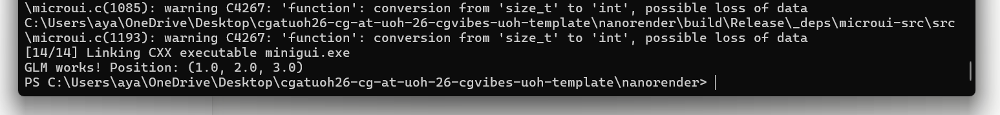
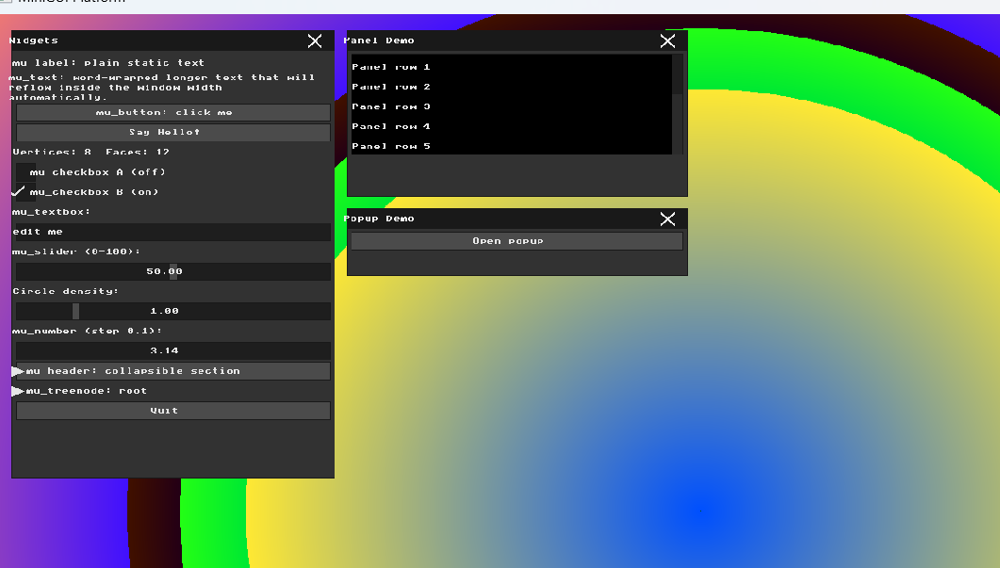
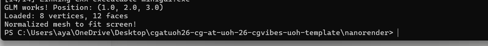

# HW2 Report: Wireframe Viewer and Geometric Transformations

## Part 0: Introduction to GLM
I added GLM to the project by updating `CMakeLists.txt` to fetch it automatically using `FetchContent`. To verify it worked, I created a `glm::vec3` position and a translation matrix, then printed the position to the console. GLM is a header-only math library that makes 3D transformations much easier to write and understand.

## Part 1: Loading and Inspecting 3D Data
I wrote a `load_obj` function that reads `.obj` files line by line. Lines starting with `v` are parsed as vertices (x, y, z), and lines starting with `f` are parsed as faces (triangle indices). I created a simple `cube.obj` file with 8 vertices and 12 triangular faces to test the loader. The mesh info is displayed in the GUI showing "Vertices: 8  Faces: 12".

## Part 2: Normalization and the Viewport Transform
I wrote a `normalize_mesh` function that finds the bounding box of the mesh by scanning all vertices for min/max x and y values. Then I calculated a uniform scale factor by dividing the screen size by the mesh range, taking the smaller of the two axes to ensure the mesh fits in both dimensions. Finally I translated the mesh center to the screen center so the model always appears centered regardless of its original coordinates.

