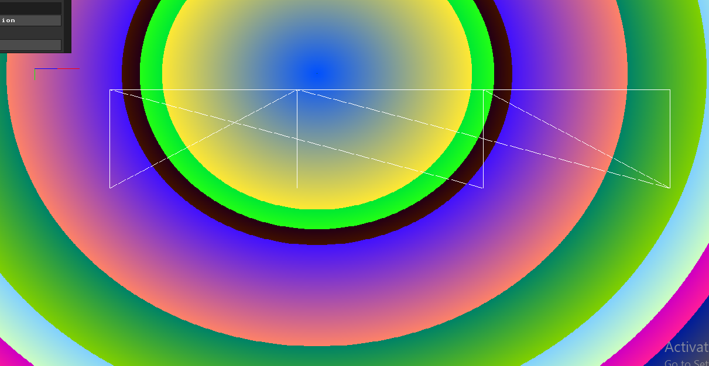
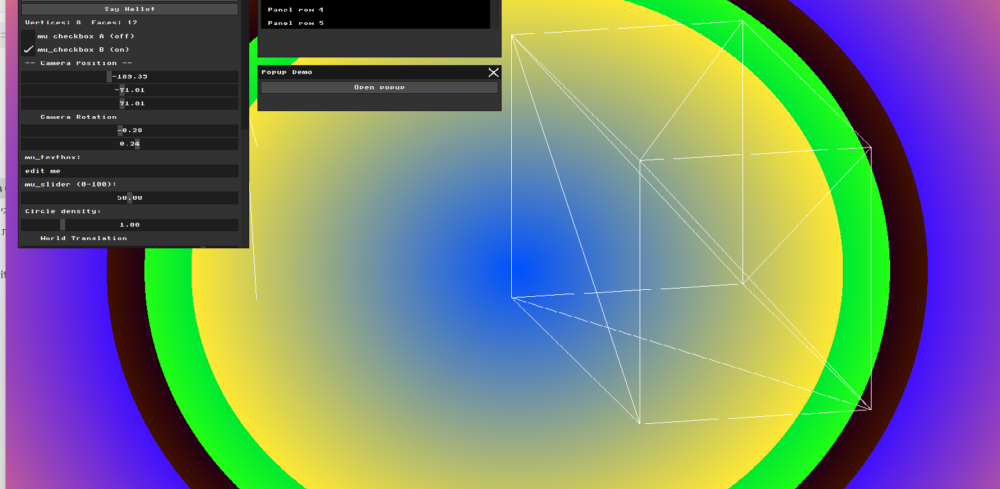
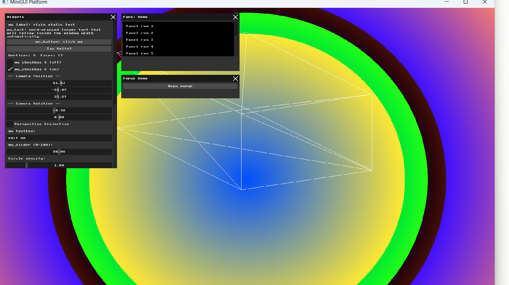
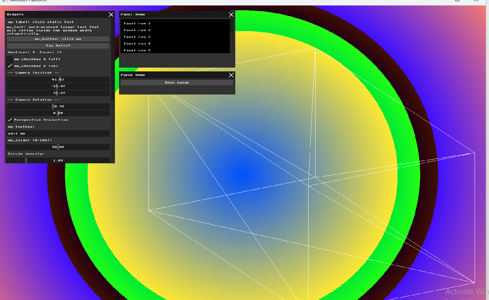
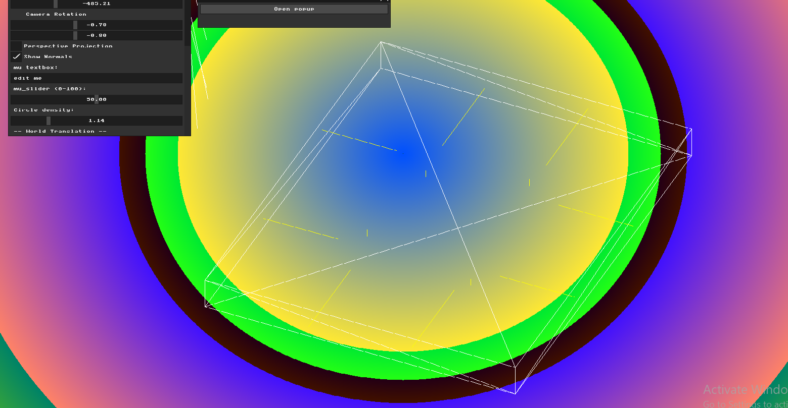

# HW3 Report: Virtual Cameras and Projections

## Part 1: Coordinate Frames and Bounding Boxes
I added two debug checkboxes to the UI — "Show Axes" and "Show Bounding Box". When Show Axes is enabled, three colored lines are drawn from the model's center: red for X, green for Y, and blue for Z. The axes transform correctly with the model — when I apply world transformations, the axes move with the cube.

## Part 2: The Virtual Camera (View Matrix)
I created a camera with position (x, y, z) and rotation (rx, ry) properties controlled by GUI sliders. The View matrix applies the inverse of the camera's transformation to all vertices — moving the camera left shifts the world right. I multiply the matrices as: View * World * Local * vertex. When I rotate the camera, the cube appears to rotate in 3D space.

## Part 3: Perspective Projection
I used GLM's `glm::perspective` function to create a perspective projection matrix with 60° FOV, the window's aspect ratio, and near/far clipping planes of 0.1 and 10000. I added a checkbox to toggle between orthographic and perspective modes. In perspective mode, objects further away appear smaller, creating a realistic depth effect. The matrix multiplication order is: Projection * View * World * Local * vertex.

## Part 4: Calculating Normals
I computed face normals using the cross product of two edges of each triangle: `normal = normalize(cross(edge1, edge2))`. The direction of the normal depends entirely on the **winding order** of the vertices in the face definition.

**The Winding Order Problem:** Initially, some normals pointed inward instead of outward. This happened because the `.obj` file had inconsistent face definitions — some faces listed their vertices clockwise and others counter-clockwise. Since the cross product gives a different direction depending on which order you compute it, inconsistent winding = inconsistent normals.

**The Fix:** I corrected the face definitions in `cube.obj` to ensure all faces use a consistent counter-clockwise winding order when viewed from outside the cube. After this fix, all 12 face normals point correctly outward from their respective faces.

I visualized the normals as yellow lines sticking out from each face center. The normals transform correctly with the model when rotations are applied.

