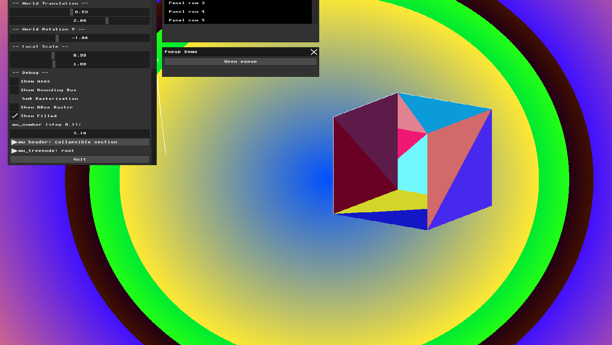
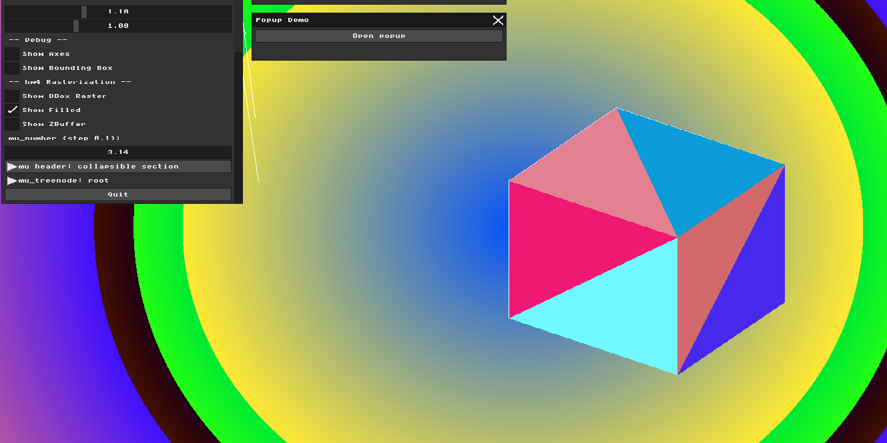
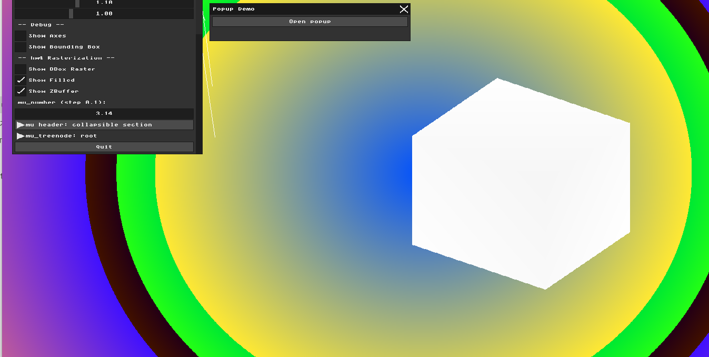

# HW4 Report: Triangle Rasterization and Depth Buffering

## Part 1: Bounding Box Rasterization
I implemented bounding box rasterization as a debug view. For each triangle, I find the minimum and maximum x and y screen coordinates of its three projected vertices. This defines a 2D bounding rectangle. I fill every pixel inside this rectangle with a random color assigned to that triangle.

The result shows overlapping colored rectangles — each representing the bounding box of one triangular face of the cube. This is a useful debug tool because it shows exactly which screen region each triangle occupies before we do the more expensive per-pixel inclusion test.

I also fixed the coordinate pipeline in this assignment — vertices are now kept in proper world space (-1 to 1) and transformed through the full MVP pipeline (Model * View * Projection), followed by a viewport transform to convert NDC coordinates to screen pixels.

## Part 2: Triangle Filling with Barycentric Coordinates
I implemented triangle filling using Barycentric Coordinates. For each pixel inside the bounding box, I calculate three weights (alpha, beta, gamma). If all three are >= 0, the pixel is inside the triangle and gets colored.

The result shows a solid colored cube, but with visible artifacts — some back-facing triangles are drawn on top of front-facing ones (the Painter's Algorithm problem). This will be fixed in Part 3 with the Z-Buffer.

## Part 3: The Z-Buffer Algorithm
I added a Z-buffer — a float array the same size as the color buffer, initialized to a very large number each frame. For each pixel, I interpolate the depth using barycentric coordinates (z = alpha*z0 + beta*z1 + gamma*z2). If the new depth is less than the stored value, I update both the color buffer and Z-buffer.

The result is a perfectly solid cube with correct depth ordering — front faces correctly occlude back faces. The Z-buffer visualization shows the cube in grayscale — white means close to the camera.

