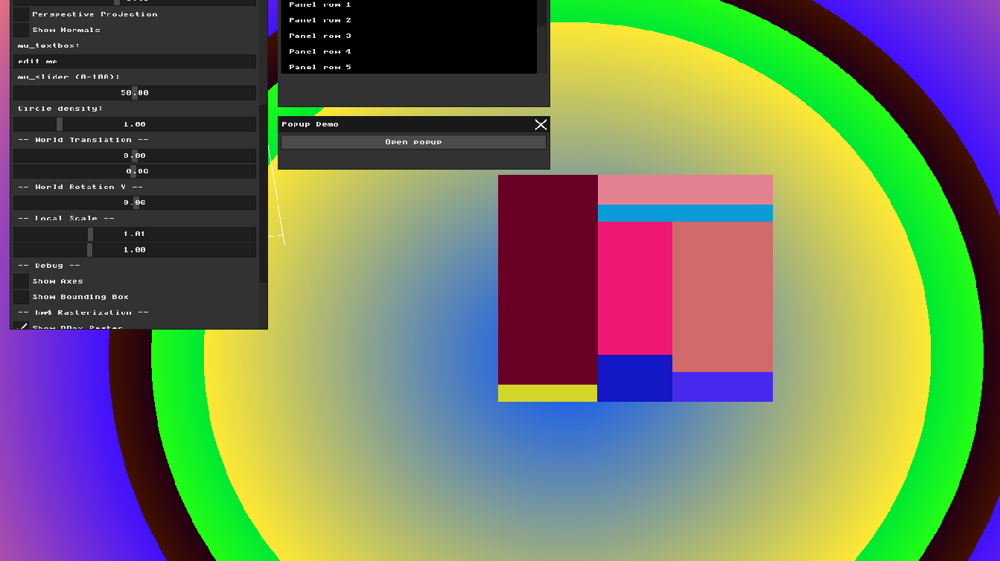

# HW4 Report: Triangle Rasterization and Depth Buffering

## Part 1: Bounding Box Rasterization
I implemented bounding box rasterization as a debug view. For each triangle, I find the minimum and maximum x and y screen coordinates of its three projected vertices. This defines a 2D bounding rectangle. I fill every pixel inside this rectangle with a random color assigned to that triangle.

The result shows overlapping colored rectangles — each representing the bounding box of one triangular face of the cube. This is a useful debug tool because it shows exactly which screen region each triangle occupies before we do the more expensive per-pixel inclusion test.

I also fixed the coordinate pipeline in this assignment — vertices are now kept in proper world space (-1 to 1) and transformed through the full MVP pipeline (Model * View * Projection), followed by a viewport transform to convert NDC coordinates to screen pixels.

