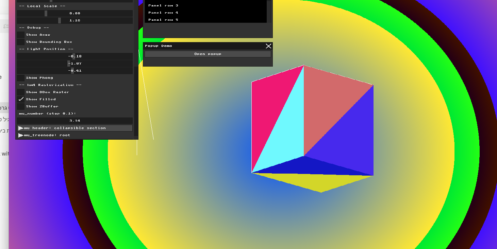
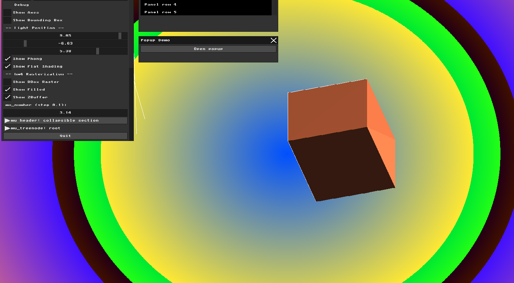
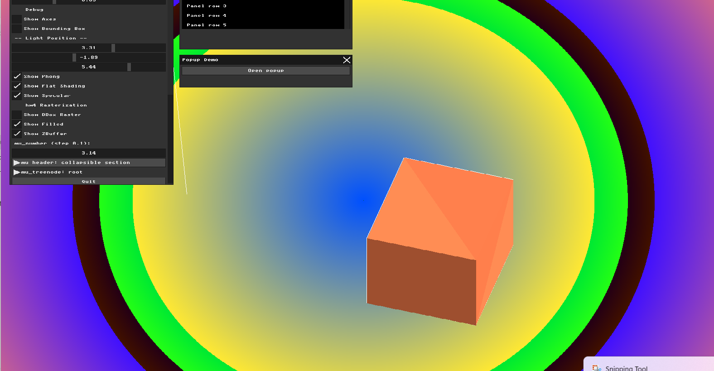
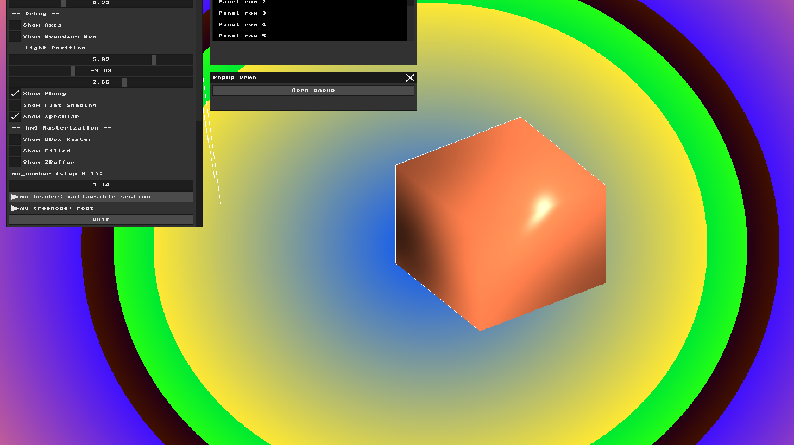

# HW5 Report: Lighting, Materials, and Shading

## Part 1: Light Sources and Material Properties
I created a `PointLight` struct with position and ambient/diffuse/specular color components, and a `Material` struct with matching properties plus a shininess value. I added UI sliders to control the light's X, Y, Z position in real time. The material is set to an orange color (1.0, 0.5, 0.3) with white specular highlights. For now only the ambient component is implemented — the object looks flat but responds to material color changes.

## Part 2: Flat Shading (Diffuse Lighting)
I implemented flat shading using Lambert's Cosine Law. For each triangle, I calculate the dot product between the face normal and the light direction vector. A higher dot product (face pointing toward light) gives a brighter color. I add this diffuse component to the ambient component.

The result shows the cube with realistic shading — faces pointing toward the light are bright orange, while faces pointing away are dark. Moving the light position sliders changes the shading in real time.

## Part 3: Specular Highlights
I added the specular component using the reflection vector. For each face, I calculate the reflection of the light direction against the face normal using `glm::reflect`. Then I compute the dot product between the reflection vector and the view direction (camera direction). Raising this to the power of the material's shininess gives a concentrated bright highlight.

The result shows a bright highlight on the face that reflects light directly toward the camera. Moving the light position sliders changes where the highlight appears.

## Part 4: Phong Shading (Per-Pixel Shading)
I implemented Phong shading by calculating the full lighting equation for every single pixel. For each pixel, I use barycentric coordinates to interpolate the vertex normals and 3D position. Then I calculate ambient + diffuse + specular lighting using the interpolated normal and position.

The result is dramatically smoother than flat shading — the cube looks like a real 3D rounded object with a beautiful specular highlight. The edges between faces are completely invisible.

